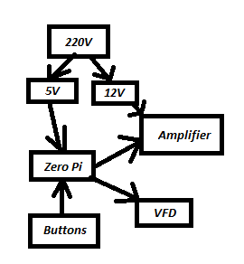
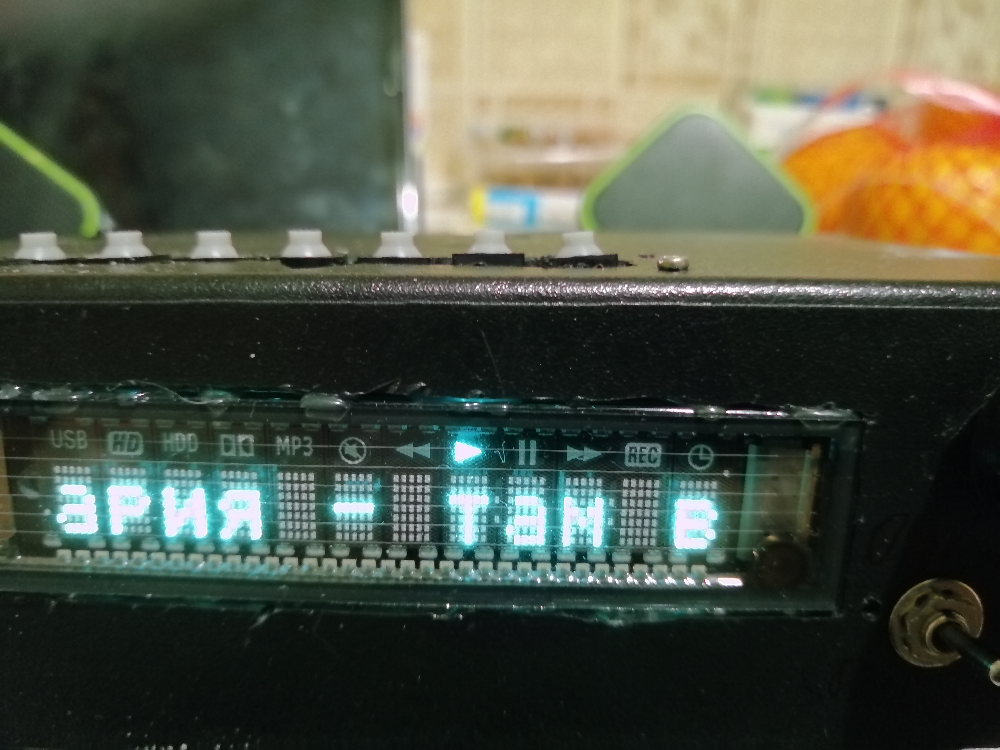

# music player
orange pi (mpd + mpc) + VFD + amplifier (TDA7851L) 

## scheme:

## program:
music_player  - starts with system and just launch:
* pwm_cooler
    > control fan by PWM
    > need compile (request wiringPi), command: 
    > g++ pwm_cooler.cpp -lwiringPi -o pwm_cooler
* mpc_update
    > update mpc output every 1 second
* music_control_v2
    > keystroke handler
* vfd_text
    > send text and symbols on VFD
    > need compile (request wiringPi), command: 
    > g++ vfd_text.cpp -lwiringPi -o vfd_text

## device:
